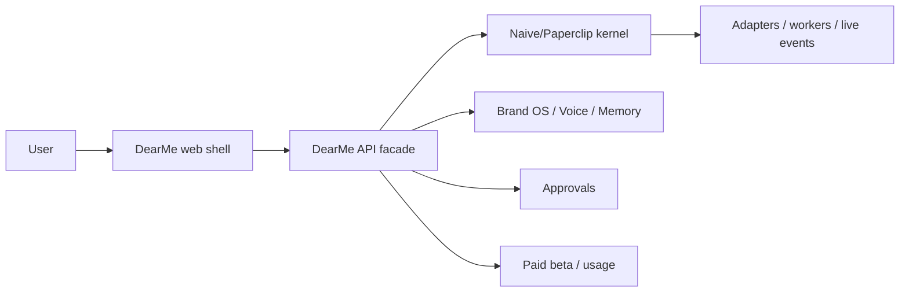

# DearMe Web UI Reuse Architecture

Date: 2026-05-08
Scope: Web-first DearMe product shell, UI reuse, and next implementation slices.

## Executive Decision

DearMe should be a web product with a premium personal-brand growth-team shell.

The product should not copy Polsia's visual style. Polsia is the source for
product choreography: fast start, visible team motion, cycles, reports, proof of
work, and the feeling that work happened while the user was away.

The product should not wait for a complete proprietary Naive front-end source
drop. The local Paperclip/Naive front-end lineage is already useful for runtime,
live progress, approvals, companies, issues, documents, and workbench mechanics,
but it is still too control-plane-shaped to be the final DearMe customer shell.

The highest-value web UI donor currently available is Littlebird. Lindy is a
secondary pattern donor for polished assistant interactions, modal/drawer
behavior, prompt input ergonomics, and section-level loading/error boundaries.

The final direction:

> DearMe web = Polsia choreography + Naive/Paperclip hidden runtime + Littlebird
> product-shell patterns + Lindy assistant polish + DearMe brand language.

## Product Rule

Team visible, machinery hidden.

Users should see:

- Chief of Staff
- Voice Editor
- Content Producer
- Opportunity Scout
- Portfolio Builder
- Growth Analyst
- daily and weekly Dear me letters
- work ready for approval
- decisions that matter

Users should not see:

- Paperclip
- OpenClaw
- OK Partner
- setup payload
- provider setup
- adapter IDs
- raw agents/runtime logs
- model-provider details
- MCP/plugin plumbing

## Source Inventory

### Verified Source Status - 2026-05-08

This pass corrected one important assumption: DearMe has strong local
Paperclip source and DearMe implementation code, but it does not have a
complete reusable Naive proprietary product source drop.

Verified local status:

- DearMe current fork is runnable implementation source. The strongest direct
  code reuse is already inside `/Users/peter/dearme`: DearMe routes, Brand OS
  services, workbench services, approvals, output handoff, and UI primitives.
- Paperclip OSS source exists under
  `/Users/peter/naive-research-2026-05-05/paperclipai/paperclip` and remains
  the concrete substrate reference for auth, companies, issues, approvals,
  documents, live runs, adapters, and cost/runtime surfaces.
- Naive private product behavior is mostly research evidence: architecture
  notes, recon docs, captured `setup_payload`, and product observations. Treat
  it as an architecture and choreography source unless a specific executable
  file is verified.
- Littlebird source exists and is the best available web-shell/onboarding donor
  for DearMe's customer-facing browser product.
- Lindy source exists and is the best available premium assistant/UI pattern
  donor for section boundaries, drawers, modals, prompt/composer behavior, and
  transcript/action surfaces.
- Polsia recon exists and should drive product choreography, automation rhythm,
  proof-of-work packaging, and marketing loops. It should not drive DearMe's
  visual system.
- Symphony currently appears in DearMe planning docs as a worker/coordination
  model. No active `symphony` binary was found on PATH during this pass, so it
  should be treated as a development-loop pattern until a runnable local tool is
  verified.

Practical consequence:

- Reuse Paperclip/DearMe code directly.
- Reuse Naive private product findings as design/architecture constraints, not
  as copyable implementation.
- Reuse Littlebird and Lindy for web UI patterns.
- Reuse Polsia for the visible-team product loop.

### Current DearMe Web

Primary path:

- `/Users/peter/dearme/ui/src/pages/DearMeOnboarding.tsx`

Useful current patterns:

- route/focus parsing for decision-state routing
- Team Workbench composition
- Voice & Memory panel
- first-cycle packaging
- Work Ready and Decisions Needed concepts
- paid-beta gate
- weekly Dear me report surface
- approval-gated actions

Assessment:

- Keep the product semantics.
- Split the monolithic page into reusable DearMe-owned components.
- Improve visual hierarchy and spacing before adding more features.
- Do not throw away the route/focus logic. It is already the right direction
  for approval and decision work.

### Littlebird

Primary path:

- `/Users/peter/research/littlebird-2026-04-23/recovered-source/src`

High-value files and patterns:

- `features/onboarding-v2/onboarding.tsx`
  - focused, animated, step-based onboarding
  - desktop/web split
  - progressive reveal rather than a large static form
- `features/onboarding-v2/onboarding-step.tsx`
  - reusable onboarding step anatomy
- `routes/team/join.tsx`
  - centered trust-heavy acceptance screen
  - success state
  - confirm modal for state-changing action
- `features/hummingbird/hummingbird-chat.tsx`
  - compact assistant header
  - actions menu
  - copy/paste affordances
  - current-context attachment pattern
- `features/hummingbird/hummingbird-message-list.tsx`
  - reusable conversation list pattern
- `features/todos/*`
  - task row/list primitives that can map to Work Ready and Decisions Needed
- `features/hive/*`
  - inbox/query/card/composer primitives that can map to opportunity review
- `features/settings/*`
  - settings section and modal patterns for Brand OS and Voice & Memory
- `features/subscription/*`
  - paid access, plan, and status patterns
- `providers/*` and route files
  - app shell and route gating patterns

Reuse verdict:

- Use Littlebird as the primary web-shell donor.
- Copy/adapt interaction structure and component anatomy.
- Replace Littlebird product language, stores, APIs, desktop assumptions, and
  platform-specific features.
- Do not import Littlebird wholesale. Fold the useful patterns into
  DearMe-owned components.

### Lindy

Primary path:

- `/Users/peter/lindy-extraction/01_frontend_source/src`

High-value files and patterns:

- `layouts/Home/HomeLayout.tsx`
  - two-column home shell
  - sidebar/content/modal overlay composition
- `layouts/CommonLayout/CommonLayout.tsx`
  - full-screen app frame and global overlays
- `layouts/Home/sections/HomeDashboard/HomeDashboard.tsx`
  - primary/secondary rail composition and staggered reveal
- `layouts/Home/sections/HomeHeader/HomeHeader.tsx`
  - compact page header with contextual actions
- `layouts/Home/components/HomeContent.tsx`
  - centered scroll container
- `components/SectionBoundary.tsx`
  - Suspense plus error boundary wrapper
- `components/layouts/ResizableSlideOutPanel.tsx`
  - right-side inspector / decision drawer pattern
- `components/transcript/Response.tsx`
  - clean transcript response wrapper
- `components/prompt/PromptInput.tsx`
  - full prompt composer behavior, attachment handling, billing guards, stop
    execution states, and prompt starters
- `components/modals/LindyPendingApprovalModal.tsx`
  - approval modal precedent
- `components/design/*`
  - modal, menu, popover, icon button, switch, row, text area, dropdown

Reuse verdict:

- Use Lindy selectively for premium assistant and layout behavior.
- Copy small primitives only when they are cleaner than local primitives.
- Do not copy Lindy's template marketplace IA.
- Do not copy generated GraphQL/Relay coupling unless a specific component
  becomes cheaper to port than rewrite.

### Naive / Paperclip

Primary path:

- `/Users/peter/naive-research-2026-05-05/paperclipai/paperclip/ui/src`
- current active fork: `/Users/peter/dearme/ui/src`

Source reality:

- The Paperclip OSS tree is concrete source and may be copied/adapted where it
  is cleaner than the current fork.
- The current DearMe fork is the real implementation surface for revenue-ready
  work.
- Captured Naive-specific private cloud behavior, tenant VM behavior, billing,
  and proprietary orchestration should be considered research evidence unless
  a specific local source file is verified.

High-value files and patterns:

- layout/sidebar/company routing
- live updates provider
- approval cards and approval detail
- issue/work/document surfaces
- run transcript components
- active agent panels
- command palette
- cost/budget cards
- workspace/runtime controls

Reuse verdict:

- Keep as hidden substrate and internal mechanics.
- Adapt live progress, approvals, transcripts, documents, and work items into
  DearMe product language.
- Do not present raw issue, routine, adapter, provider, or workspace concepts as
  the main product IA.
- Do not wait for Naive UI to become a complete product shell. DearMe needs its
  own customer-facing web layer now.

### Polsia

Primary path:

- `/Users/peter/Desktop/polsia-recon-2026-05-05`

High-value patterns:

- one-input onboarding
- immediate dashboard motion
- role-based AI team
- public/private proof of work
- live feed as trust asset
- cycle, report, and deliverable rhythm
- "work happened while I was away" promise

Reuse verdict:

- Copy the choreography.
- Do not copy the visual style directly.
- Do not copy the company factory framing.
- Translate company work into personal-brand work.

## Copy / Adapt / Reject Matrix

| Source | Copy | Adapt | Reject |
| --- | --- | --- | --- |
| Polsia | team choreography, cycles, live proof, reports | onboarding wow, public proof flywheel | quirky UI, company factory, public raw personal data |
| Naive/Paperclip | Paperclip runtime, approvals, live events, documents, work items; current DearMe services/routes | Naive setup_payload findings into brand_blueprint/setup intent | raw control-plane IA as customer UI; unverified private Naive backend/UI assumptions |
| Littlebird | onboarding anatomy, focused web shell, todo/hive/task patterns | assistant chat, settings, subscription patterns | desktop-only assumptions, Littlebird copy, wholesale store/API port |
| Lindy | section boundary, modal/drawer, transcript response, prompt composer ideas | home layout, dashboard rails, approval modal | marketplace browsing IA, GraphQL coupling, Lindy product language |

## Target Web Information Architecture

P0 web surfaces:

1. Home
2. Team Workbench
3. Onboarding / First Cycle
4. Decisions Needed
5. Work Ready
6. Voice & Memory
7. Brand OS
8. Content
9. Opportunities
10. Portfolio
11. Dear me Reports
12. Paid Beta / Usage

The first customer screen should not be an admin dashboard. It should show:

- what the team did
- what the team is doing now
- what is ready
- what needs approval
- what changed in Brand OS memory
- what the next letter says

## Target Screen Structure

### Home

Purpose:

- Returning-user summary.
- "My team worked while I was away" feeling.
- One clear next decision.

Structure:

- Top bar with DearMe identity, status, and one primary action.
- Dear me letter strip summarizing the latest cycle.
- Live team feed showing current role-owned work.
- Decisions Needed queue.
- Work Ready queue.
- Voice & Memory snapshot.
- Brand OS health snapshot.
- Proof and opportunity metrics.

### Team Workbench

Purpose:

- Let the user watch the AI team work without managing runtime internals.

Structure:

- Left rail: team roster and current workstream.
- Center: active artifact, evidence, and draft output.
- Right rail: decisions, approvals, memory, and context.
- Optional inspector drawer for provenance, revision history, and rationale.

Interaction model:

- Route-driven focus state.
- One primary action per focused work item.
- Batch review for low-risk approvals.
- Human language for all work states.

### Onboarding / First Cycle

Purpose:

- Produce the first wow moment in 90 seconds.

Structure:

- One question: "What do you want to become known for?"
- Optional imports framed as acceleration, not setup debt.
- Immediate first-cycle preview:
  - draft Voice Profile
  - 3 starter posts
  - 1 opportunity lead
  - 1 portfolio proof card
  - first growth plan
- Centered premium flow inspired by Littlebird onboarding and team-join screens.

### Decisions Needed

Purpose:

- Make DearMe feel like a team that prepares work and asks for high-leverage
  decisions.

Structure:

- Single decision focus by default.
- Evidence strip.
- Proposed output.
- Risk label.
- Approval actions:
  - approve
  - edit
  - request changes
  - reject
  - batch approve when safe
- Optional Lindy-style drawer for deeper rationale.

### Work Ready

Purpose:

- Show reviewable artifacts, not agent logs.

Work item types:

- post draft
- essay/newsletter draft
- outreach draft
- opportunity lead
- profile/bio update
- portfolio proof card
- weekly report section
- brand memory update

### Voice & Memory

Purpose:

- Make trust and personalization visible.

Structure:

- Voice Profile score and rules.
- Latest saved memories.
- Approved phrases and forbidden phrases.
- Proof points.
- Goals and boundaries.
- "Make this more like me" feedback loop.

### Brand OS

Purpose:

- Customer-facing operating system for the user's public self.

Core entities:

- positioning
- audience
- offers
- proof
- themes
- channels
- voice
- boundaries
- opportunity criteria
- public assets

### Dear me Reports

Purpose:

- Retention ritual and proof of work.

Structure:

- What the team did.
- What changed.
- What is ready.
- What needs approval.
- What the team learned.
- Next week's bets.

## Technical Architecture

DearMe should keep separate frontend and API layers.

Reason:

- The frontend owns the premium product experience, routing, rendering,
  approval interaction, and browser responsiveness.
- The API owns company scoping, auth, persistence, approvals, Brand OS memory,
  work products, runtime dispatch, cost events, and adapter isolation.
- The runtime substrate must stay server-side so provider keys, worker details,
  and private execution state do not leak into the browser.

The UI should call DearMe-owned API surfaces instead of directly calling
Paperclip-shaped endpoints wherever the user-facing concept differs.

Recommended boundary:

The key product boundary:

- UI speaks DearMe.
- API translates DearMe into durable product objects.
- Kernel executes work.
- Runtime machinery remains backstage.

## Reuse Strategy

### Immediate Reuse

1. Keep current DearMe route/focus and approval-state logic.
2. Split current monolithic DearMe page into DearMe-owned component primitives.
3. Copy/adapt Littlebird onboarding step anatomy.
4. Copy/adapt Littlebird centered trust/confirmation screen.
5. Copy/adapt Lindy SectionBoundary behavior.
6. Copy/adapt Lindy right-side inspector pattern.
7. Keep Paperclip approval/work/document/runtime mechanics.

### Later Reuse

1. Littlebird task/todo rows into Work Ready.
2. Littlebird hive/inbox patterns into Opportunities.
3. Littlebird subscription patterns into Paid Beta / Usage.
4. Lindy transcript response into Chief of Staff chat and Dear me letter.
5. Lindy prompt input ideas into the Chief of Staff command composer.
6. Paperclip run transcript and live updates into team feed.

### Rejected Reuse

1. Polsia's visual style.
2. Lindy's template marketplace.
3. Littlebird desktop-specific affordances.
4. Raw Paperclip admin pages as the DearMe customer shell.
5. Wholesale donor repo imports that preserve incompatible product language or
   state models.

## Implementation Order

### Slice 1: DearMe Shell Primitives

Status: mostly implemented in the current integration tree.

Current reusable primitives in `/Users/peter/dearme/ui/src/components/DearMeShell.tsx`:

- `DearMePageShell`
- `DearMeHero`
- `DearMePanel`
- `DearMeWorkbenchSectionHeader`
- `DearMeCockpitGrid`
- `DearMeMetricStrip`
- `DearMeFocusSurface`
- `DearMeEvidenceGrid`
- `DearMeWorkbenchCard`
- `DearMeEmptyState`
- `DearMeChecklist`
- `DearMeSectionBoundary`

Still missing or not yet promoted:

- `DearMeHeader`
- `DearMeInspector`
- `DearMeDecisionCard`
- `DearMeWorkItemCard`
- `DearMeTeamFeed`

Current decision:

- Do not spend the next slice recreating generic shell primitives.
- Use the existing DearMe primitives to split the monolithic page and build a
  premium Home/Team Workbench/Decision surface.
- Add only the missing workbench-specific primitives that unlock a visible user
  flow.

### Slice 2: Premium Team Workbench

Replace the dense current workbench layout with:

- letter strip
- team feed
- active artifact panel
- decision queue
- voice/memory snapshot
- Brand OS health snapshot

Verification:

- desktop browser screenshot
- mobile browser screenshot
- no console errors
- no substrate-name leaks
- existing DearMe tests pass

### Slice 3: First-Cycle Onboarding

Adapt Littlebird's step-based onboarding into a DearMe first-cycle funnel.

Required output within the first pass:

- Voice Profile draft
- 3 starter posts
- 1 opportunity lead
- 1 portfolio proof card
- first growth plan

### Slice 4: Decisions Drawer

Adapt Lindy's drawer/modal patterns into a DearMe decision inspector.

Use for:

- approve/reject/edit
- rationale
- provenance
- risk boundary
- revision history

### Slice 5: Chief of Staff Composer

Adapt Lindy/Littlebird assistant prompt patterns into a DearMe command surface.

Use for:

- "make this more like me"
- "find better opportunities"
- "turn this into a post"
- "prepare this for approval"
- "write my weekly letter"

## Parallel Worker Coordination

The current checkout is a mixed integration tree on
`codex/dearme-baseline-2026-05-08` with many existing modifications. Do not
let multiple agents freely edit the same files in this checkout.

Recommended split:

- One long-running lead Codex thread owns architecture, donor decisions,
  BUILD-STATE, final integration, and verification claims.
- Product-code workers use isolated worktrees after a recoverable DearMe
  baseline exists.
- Start with the documented `DM-005A` integration-baseline/product-spine ticket
  before assigning product-code tickets like output review/regeneration.
- Keep product-code tickets narrow: one write scope, one protected scope, one
  verification list, one acceptance definition.
- Architecture-only passes may edit docs in the active checkout, but should not
  race with implementation workers editing the same docs.

This keeps the benefits of a persistent Codex goal and Symphony-style workers
without turning the dirty integration checkout into an unreviewable shared
scratchpad.

## Guardrails

- No broad rewrites until the shell primitives are extracted.
- No new dependency unless a donor primitive cannot be reasonably adapted with
  existing UI utilities.
- No substrate names in customer UI.
- No external publish/send/deploy/spend without approval.
- No hidden automatic posting.
- No raw personal work in public proof surfaces.
- No Polsia visual clone.
- No Lindy marketplace clone.
- No Littlebird desktop clone.

## Current Verdict

DearMe is now closer to maximizing reuse, but the reuse map has to stay
source-honest:

- Polsia: product feeling and marketing choreography.
- Naive: setup_payload-style bootstrap, per-tenant/team product architecture,
  and automation rhythm as research-backed patterns.
- Paperclip/current DearMe fork: hidden execution, approval, document, workbench,
  output-handoff, and runtime substrate as real code.
- Littlebird: primary web product shell and onboarding/work item donor.
- Lindy: premium assistant, modal, drawer, and response rendering donor.
- DearMe: personal-brand semantics, product vocabulary, Brand OS, voice, memory,
  and trust boundary.

The next code slice should not be another generic feature. It should be one of:

1. `DM-005A` integration baseline/product spine so parallel workers can use a
   recoverable base.
2. Premium Home/Team Workbench composition using the existing DearMe shell
   primitives.
3. Internal setup-intent contract that turns Naive's `setup_payload` lesson into
   a DearMe-owned brand_blueprint/setup payload path with budget gates.
